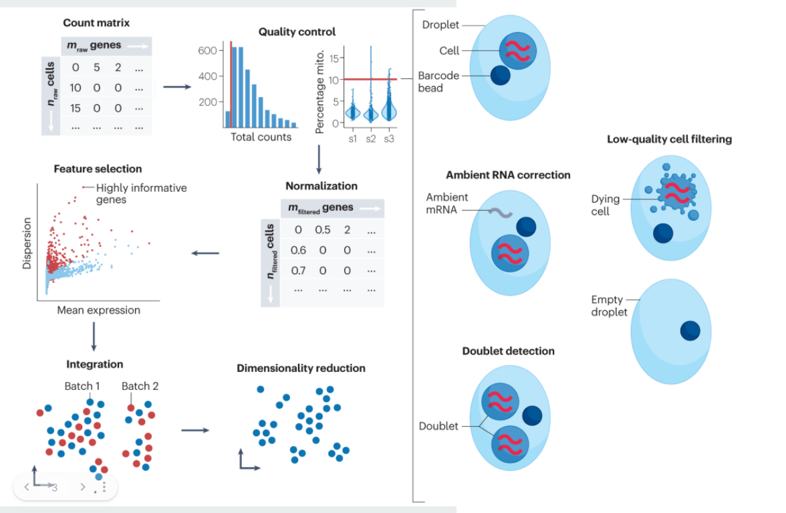

# Single-Cell RNA-seq Analysis Pipeline

Python pipeline developed for my Bachelor's thesis for preprocessing, clustering and analysis of single-cell RNA sequencing data.

---

## Analysis Workflow

---

## Cell Type Identification

UMAP embedding of cells with annotated cell types.

---

## Cell–Cell Communication

Heatmap diagram showing global communication patterns between cell populations.

---

